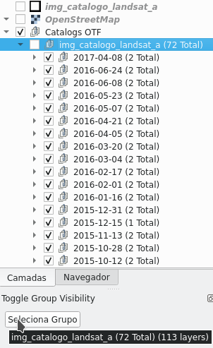

# Toggle Group Visibility Plugin  

***Toggle Group Visibility*** is a panel plugin for change a visible item(group or layer) inside a group(mutually exclusive), that can be done manually or automatically, by buttons or shortcuts of keyboard.  
  

## Steps: ##  

* **Define a group for change the visibility of its items :**  
  * Add panel in QGIS.  

  * Select a group.  
  \* The select group is the current group  in layers panel.  

* **Plugin Panel:**  
  * Up: Change visibility to the above item(shortcut '<').
  * Down: Change visibility to the below item(shortcut '>').
  * Loop: Change visibility automatically(shortcut 'L').
    * Time: The time in seconds to change item.
    * Direction: Up(above) or Down(below).
  * Set current: Set the visible item in layer panel(shortcut '?').
  * Copy: Copy the visible item to 'GroupVisibility' group(shortcut 'C').
  * Enable shortcuts: Enable/disable shortcuts

* **Example:**

